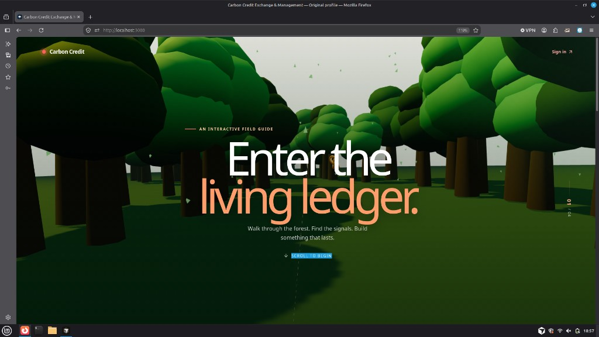
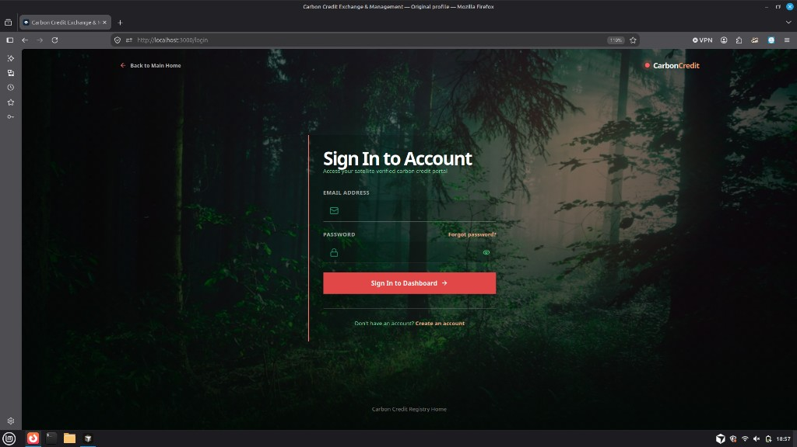
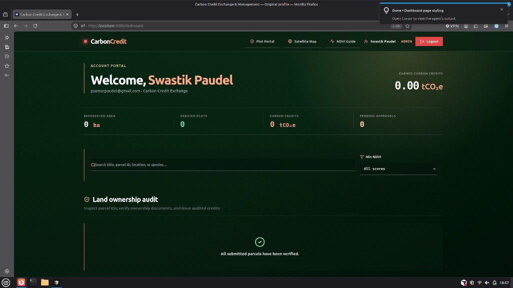
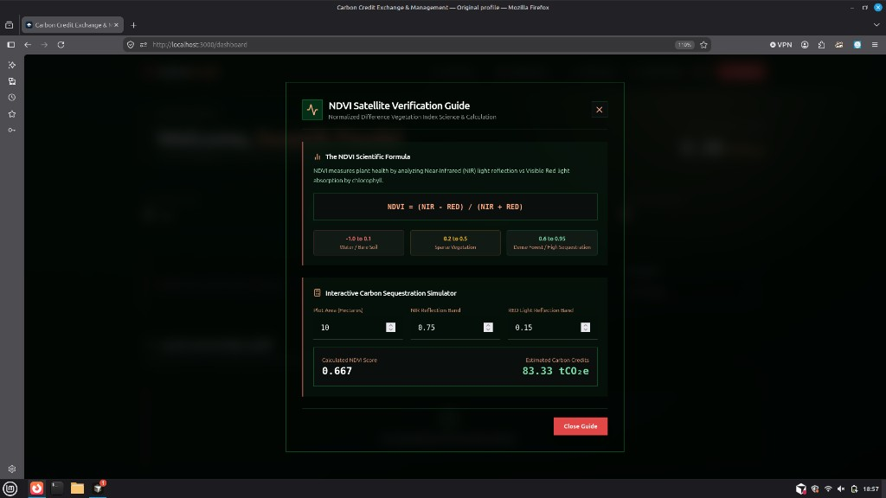
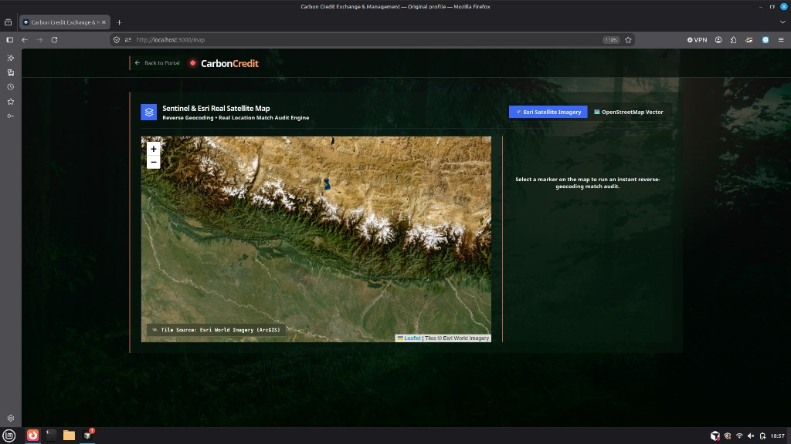
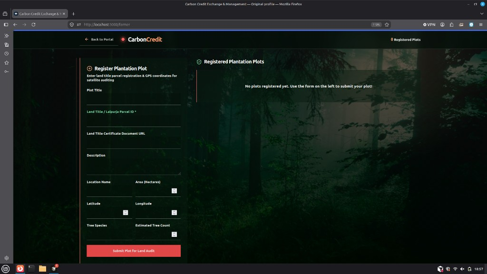

# Carbon Credit

**Carbon Credit Exchange & Management** — a satellite-verified marketplace where farmers register reforestation plots, admins audit land ownership with NDVI science, and businesses purchase transparent carbon offsets.

Walk through the forest. Find the signals. Build something that lasts.

## Screenshots

### Interactive landing — living ledger

Immersive Three.js forest field guide. Scroll through the canopy to enter the platform.



### Sign in

Forest-backed auth portal for farmers, businesses, and administrators.



### Account portal / dashboard

Role-aware dashboard with credit balance, reforested area, verified plots, pending approvals, search, and land-ownership audit tools.



### NDVI verification guide

Educational modal with the NDVI formula, reference scale, and an interactive sequestration simulator (`NDVI = (NIR − RED) / (NIR + RED)`).



### Satellite map

Leaflet map with Esri World Imagery and OpenStreetMap layers, reverse geocoding, and location match audit for plantation markers.



### Farmer plot portal

Register plantation plots with Lalpurja / land title parcel IDs, GPS coordinates, species, and document URLs for satellite auditing.



## What it does

| Role | Workflow |
|------|----------|
| **Farmer** | Register plots (parcel ID, coords, docs) → track verification → earn credits |
| **Admin** | Audit ownership → set NDVI → approve/reject → issue credits |
| **Business** | Browse verified listings → purchase offsets → ledger & certificates |

## Features

- Immersive **3D forest landing** (Three.js)
- **JWT auth** with email OTP, password reset, httpOnly cookies
- **Land ownership audit** (Lalpurja / parcel ID + document links)
- **NDVI guide & calculator** for sequestration estimates
- **Esri / OSM satellite map** with reverse geocoding
- Role dashboards: farmer plots, admin workbench, business marketplace
- Carbon purchase ledger and downloadable certificates

## Tech stack

| Layer | Tools |
|-------|--------|
| App | Next.js 14 (App Router), React 18, TypeScript, Tailwind CSS |
| Database | PostgreSQL (Supabase) + Prisma |
| Auth | JWT, bcrypt, httpOnly cookies |
| Email | Nodemailer (OTP / password reset) |
| Maps / 3D | Leaflet, Esri imagery, Three.js |
| Cache | Optional Redis (`ioredis`) + in-memory LRU fallback |

## Project structure

```
src/
  app/           # Pages + API routes
  components/    # Maps, modals, forest scene, shared UI
  lib/           # Auth, DB, Redis, email helpers
prisma/          # Schema
public/          # Static assets
docs/screenshots # README images
```

## Routes

| Path | Description |
|------|-------------|
| `/` | 3D forest landing |
| `/login`, `/signup` | Authentication |
| `/dashboard` | Role-based account portal |
| `/farmer` | Plantation registration workbench |
| `/map` | Full-screen satellite map |
| `/ndvi-guide` | NDVI education / calculator |

## Getting started

### Prerequisites

- Node.js 18+
- A Supabase (or other PostgreSQL) project
- SMTP credentials (optional — OTPs print to the server console if unset)

### 1. Install

```bash
npm install
```

`postinstall` runs `prisma generate` automatically.

### 2. Environment

```bash
cp .env.example .env
```

| Variable | Purpose |
|----------|---------|
| `DATABASE_URL` | Pooled Postgres URL (port 6543, `?pgbouncer=true`) |
| `DIRECT_URL` | Direct / session Postgres URL (port 5432) |
| `SUPABASE_URL` | Supabase project URL |
| `SUPABASE_ANON_KEY` | Supabase anon key |
| `JWT_SECRET` | Secret for signed session cookies |
| `SMTP_HOST` / `SMTP_PORT` / `SMTP_USER` / `SMTP_PASS` / `SMTP_FROM` | Outbound email |

Optional: `ENABLE_REDIS=true`, `REDIS_URL`

> On Vercel, paste env values **without** wrapping quotes. Prefer `SUPABASE_*` (not `NEXT_PUBLIC_*`) so secrets can be saved as private.

### 3. Database

```bash
npx prisma db push
```

### 4. Run

```bash
npm run dev
```

Open [https://carbon-credit1.vercel.app/](https://carbon-credit1.vercel.app/).

## Scripts

| Command | Description |
|---------|-------------|
| `npm run dev` | Development server |
| `npm run build` | Production build |
| `npm start` | Serve production build |
| `npm run lint` | ESLint |

## API overview

- **Auth** — `/api/auth/signup`, `login`, `logout`, `me`, `verify-otp`, `resend-otp`, `forgot-password`, `reset-password`
- **Plantations** — `/api/plantations`
- **Admin** — `/api/admin/verify`
- **Business** — `/api/business/purchases`
- **Other** — `/api/stats`, `/api/certificates/[id]`

## Data model (Prisma)

- **User** — identity, role, OTP/reset hashes, credit balance
- **Plantation** — GPS, parcel ID, docs, NDVI, status, credits issued
- **CarbonPurchase** — business purchases against plantations
- **CarbonTransaction** — ledger / certificate trail

## Deploy (Vercel)

1. Connect [Swastik45/CarbonCredit](https://github.com/Swastik45/CarbonCredit)
2. Set env vars (no quotes; Root Directory = `.`)
3. Push to `main` or redeploy Production
4. In Supabase → Authentication → URL Configuration, add your Vercel domain

## Notes

- Without SMTP, verification OTPs are logged in the terminal.
- Redis is off by default; rate limiting uses an in-memory LRU cache.
- Reverse geocoding uses OpenStreetMap Nominatim where needed.
- Admin allowlist lives in `src/lib/adminBypass.ts`.

## License

Private project (`"private": true` in `package.json`).
